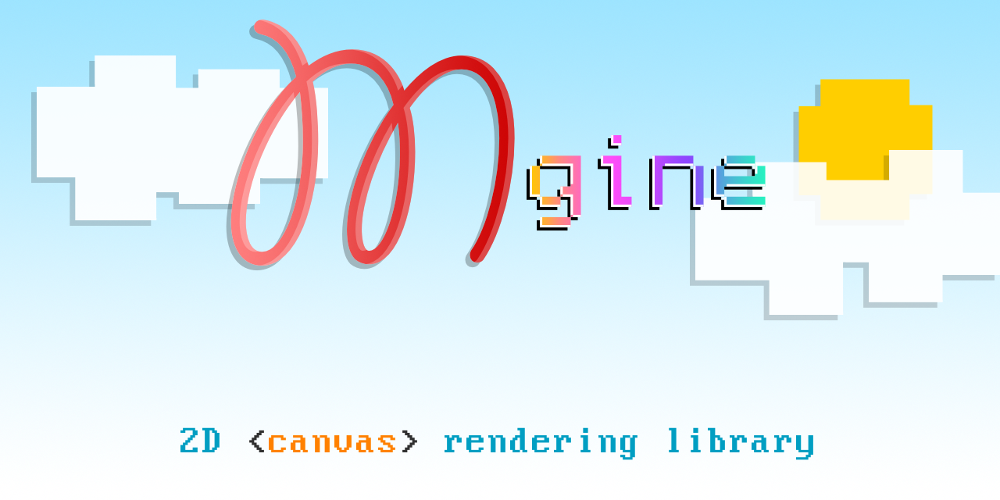

# Mgine



         <a href="https://github.com/matronator"></a> <a href="https://github.com/sponsors/matronator/"></a>

**Mgine** (read as *em*gine) is a simple library to make working with HTML5 canvas graphics easier.

## Installation

```
npm i mgine
```

```
pnpm i mgine
```

```
yarn add mgine
```

```
bun i mgine
```

## Usage

```js
import { Mgine } from 'mgine';

const mgine = Mgine.Init('canvas-id');
mgine.fillRect({ x: 10, y: 10 }, { width: 50, height: 50 }, 'green');
```
