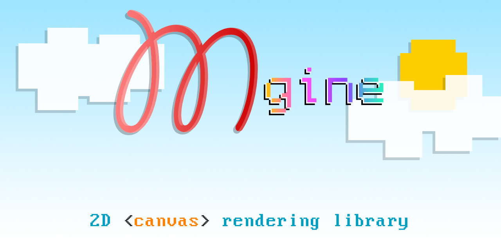

# Mgine

         <a href="https://github.com/matronator"></a> <a href="https://github.com/sponsors/matronator/"></a> [](https://www.jsdelivr.com/package/npm/mgine)

**Mgine** (read as *em*gine) is a simple library to make working with HTML5 canvas graphics easier.

## Installation

```
npm i mgine
```

```
pnpm i mgine
```

```
yarn add mgine
```

```
bun i mgine
```

## Usage

```js
import Mgine from 'mgine';

const mgine = Mgine.Init('canvas-id', { /* options */ });
// or
const mgine2 = new Mgine('canvas-id', { /* options */ });

mgine.graphics.fillRect({ x: 10, y: 10, width: 50, height: 50 }, 'green');
```

## Getting Started

### 1) Create a canvas

```html
<canvas id="game-canvas" width="800" height="600"></canvas>
```

### 2) Initialize Mgine

```ts
import Mgine from 'mgine';

const mgine = Mgine.Init('game-canvas', {
  width: 800,
  height: 600,
  pixelArt: false,
});
```

### 3) Draw with the `Graphics` instance

```ts
const g = mgine.graphics;

g.clear();
g.fillRect({ x: 40, y: 40, width: 180, height: 100 }, '#1e90ff');
g.strokeText('Hello Mgine', { x: 50, y: 95 }, { font: '24px sans-serif', color: '#ffffff' });
```

### Common initialization options

- `pixelArt`: disables image smoothing and sets pixelated rendering.
- `fillAvailableSpace`: stretches canvas to fill parent element (or window fallback).
- `width` / `height`: sets explicit canvas dimensions.
- `transparentBackground`: controls 2D context alpha behavior.

## Graphics API (public methods)

The `Graphics` class wraps Canvas 2D drawing operations. Methods below are shown with TypeScript signatures and short descriptions.

### Class signature

```ts
class Graphics {
  get ctx(): CanvasRenderingContext2D;
  constructor(ctx: CanvasRenderingContext2D);
  // ...methods below
}
```

### State & styling

```ts
setLineStyle(lineStyle?: LineStyle): void
```
Apply line width/cap/join and dash settings used by stroke operations.

```ts
setTextStyle(textStyle: TextStyle): void
```
Apply canvas text formatting (font, alignment, direction, spacing).

```ts
resetShadow(): void
```
Reset shadow color/blur/offset to no shadow.

```ts
setShadow(shadow?: Shadow): void
```
Apply shadow settings for subsequent fill/stroke/text rendering.

```ts
save(): void
restore(): void
```
Save and restore canvas state (`CanvasRenderingContext2D.save/restore`).

```ts
clear(keepTransform?: boolean): void
```
Clear the full canvas. Optionally preserve the current transform.

```ts
clearRect(rect: Rect): void
```
Clear only a rectangular area.

### Paths & primitives

```ts
pointsToPath(points: Point[], closed?: boolean): Path
```
Create and construct a `Path` from points; optionally close it.

```ts
pattern(image: HTMLImageElement, repetition?: Repetition): CanvasPattern | null
```
Create a repeatable pattern from an image.

```ts
fillRect(rect: Rect, fillStyle: Color): void
strokeRect(rect: Rect, strokeStyle: Color, lineStyle?: LineStyle): void
rect(rect: Rect, color: Color, type?: DrawingType, lineStyle?: LineStyle): void
```
Draw rectangle fills/strokes or dispatch by drawing type.

```ts
polygon(points: Point[], color: Color, type?: DrawingType, lineStyle?: LineStyle): void
```
Draw a polygon from a point list, as fill or stroke.

```ts
fillCircle(center: Point, radius: number, fillStyle: Color): void
strokeCircle(center: Point, radius: number, strokeStyle: Color, lineStyle?: LineStyle): void
circle(center: Point, radius: number, color: Color, drawingType?: DrawingType, lineStyle?: LineStyle): void
```
Draw circles with fill/stroke convenience helpers.

```ts
partialEllipse(
  center: Point,
  radius: Point,
  rotation: number = 0,
  startAngle: number = 0,
  endAngle: number = Math.PI * 2,
  counterClockwise: boolean = false,
  color: Color,
  type?: DrawingType,
  lineStyle?: LineStyle
): void
ellipse(xy1: Point, xy2: Point, color: Color, type?: DrawingType, lineStyle?: LineStyle): void
ellipseFromCenter(center: Point, radius: Point, color: Color, type?: DrawingType, lineStyle?: LineStyle): void
```
Draw ellipses from center/radius or from a bounding box corner pair.

```ts
line(from: Point, to: Point, strokeStyle: Color, lineStyle?: LineStyle): void
bezierCurve(from: Point, control1: Point, control2: Point, to: Point, strokeStyle: Color, lineStyle?: LineStyle): void
quadraticCurve(from: Point, control: Point, to: Point, strokeStyle: Color, lineStyle?: LineStyle): void
curve(strokeStyle: Color, from: Point, to: Point, control1: Point, control2?: Point, lineStyle?: LineStyle): void
linearPath(points: Point[], strokeStyle: Color, lineStyle?: LineStyle): void
```
Draw lines and curve segments, including an auto-selecting `curve(...)` helper.

```ts
fillPath(path: Path, fillStyle: Color): void
strokePath(path: Path, strokeStyle: Color, lineStyle?: LineStyle): void
path(path: Path, color: Color, type?: DrawingType, lineStyle?: LineStyle): void
```
Render prebuilt `Path` instances.

```ts
arc(
  center: Point,
  radius: number,
  startAngle: number,
  endAngle: number,
  counterClockwise: boolean = false,
  style: Color,
  type?: DrawingType,
  lineStyle?: LineStyle
): void
```
Draw a circular arc segment as fill or stroke.

### Progress utilities

```ts
progressBar(
  rect: Rect,
  progress: number,
  showText?: boolean,
  backgroundColor?: Color,
  progressColor?: Color,
  textColor?: Color,
  borderColor?: Color,
  borderWidth?: number
): void
```
Draw a rectangular progress bar with optional text and border.

```ts
circularProgressBar(
  center: Point,
  radius: number,
  progress: number,
  showText?: boolean,
  thickness?: number,
  backgroundColor?: Color,
  progressColor?: Color,
  textColor?: Color,
  maxFontSize?: number,
  lineCap?: CanvasLineCap,
  startAngle?: number
): void
```
Draw a circular progress indicator with optional percentage text.

### Images & text

```ts
drawImage(img: HTMLImageElement, coordinates: Point): void
drawImage(img: HTMLImageElement, coordinates: Point, scale?: Scale): void
drawImage(img: HTMLImageElement, coordinates: Point, size?: Dimensions): void
```
Draw an image at a point, optionally scaled by factors or resized to dimensions.

```ts
fillText(text: string, coordinates: Point, textStyle: TextStyle, maxWidth?: number): void
strokeText(text: string, coordinates: Point, textStyle: TextStyle, lineStyle?: LineStyle, maxWidth?: number): void
measureText(text: string, textStyle: TextStyle): TextMetrics
```
Draw and measure text with full text and stroke styling support.

## Types & interfaces used by the Graphics API

```ts
interface Point {
  x: number;
  y: number;
}
```
2D coordinate pair.

```ts
interface Rect {
  x: number;
  y: number;
  width: number;
  height: number;
}
```
Rectangle position and size.

```ts
interface Dimensions {
  width: number;
  height: number;
}
```
Explicit width/height pair (typically for `drawImage`).

```ts
interface Scale {
  x: number;
  y?: number;
}
```
Scale multipliers (`y` defaults to `x` inside `drawImage`).

```ts
interface Dash {
  pattern?: number[];
  offset?: number;
}
```
Line dash configuration.

```ts
interface LineStyle {
  width: number;
  cap?: CanvasLineCap;
  dash?: Dash;
  join?: CanvasLineJoin;
}
```
Stroke style options for line-based drawing.

```ts
interface Shadow {
  color?: string;
  blur?: number;
  offsetX?: number;
  offsetY?: number;
}
```
Shadow style for shapes and text.

```ts
interface TextStyle {
  font?: string;
  textAlign?: CanvasTextAlign;
  textBaseline?: CanvasTextBaseline;
  color?: Color;
  direction?: CanvasDirection;
  letterSpacing?: string;
  fontKerning?: CanvasFontKerning;
  fontStretch?: CanvasFontStretch;
  fontVariantCaps?: CanvasFontVariantCaps;
  wordSpacing?: string;
}
```
Text rendering style.

```ts
type DrawingType = 'fill' | 'stroke';
```
Controls whether a shape is filled or stroked.

```ts
type Color = string | CanvasGradient | CanvasPattern;
```
Accepted color/style value for fill and stroke operations.

```ts
type Repetition = 'repeat' | 'repeat-x' | 'repeat-y' | 'no-repeat';
```
Image pattern repeat mode.

```ts
class Path {
  start: Point;
  end: Point;
  closed: boolean;
}
```
Reusable path object from `Mgine.CreatePath(...)` (or `new Path(...)`) used by `fillPath/strokePath/path`.

